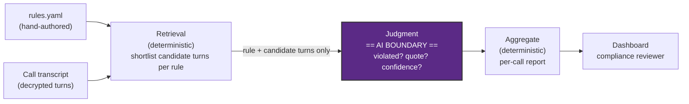

# Session 1 — Architecture & AI Boundary

## Problem

VoiceBot campaigns run automated calls at scale. Compliance rules exist
(disclose it's an AI, don't promise refund amounts, don't pressure a customer
after a refusal) but today they're checked, if at all, by occasional manual
spot-checks of a handful of calls. Violations in the rest go unnoticed.

**Goal:** review every completed call against every applicable compliance
rule automatically, and for each violation, produce the exact quote and turn
where it happened — so a human can verify in seconds instead of re-listening
to or re-reading the whole call.

## Users

- **Primary user: a compliance reviewer.** Consumes a dashboard of flagged
  calls, each with the violated rule, the offending quote, and a confidence
  score. Decides whether to act (nothing else in this system takes action on
  its own).
- **Secondary "user": this project's own iteration loop.** Session 11's
  golden set and `runs.jsonl` (experiment log) exist so *building* the system
  is itself measurable, not just its output.

There is no end-customer-facing user — this never touches the person who
received the call.

## Inputs

- A completed call's transcript (`BOT:` / `CUSTOMER:` turns, decrypted from
  Mongo — see `PROJECT_CONTEXT.md`).
- `rules.yaml` — hand-authored compliance rules: id, plain-language
  description, which turns are typically relevant, example violating/compliant
  snippets. Rules are **not** inferred by the LLM; they're fixed input data.

## Outputs

Per (call, rule) pair, a structured record:

```
{ rule_id, violated: bool, turn_index, quote, confidence }
```

Aggregated per call into a report the dashboard renders. Low confidence does
**not** get rounded to a guess — it renders as "flag for manual review."

## The AI boundary

The core design discipline this session teaches: keep the LLM's job as small
and checkable as possible. Everything else stays deterministic.

**Outside the boundary (deterministic, no LLM):**
- Which rules exist (`rules.yaml`, hand-authored).
- Retrieval: given a rule, which turns of *this* transcript are candidates
  (keyword or embedding search — Session 3 covers this; no LLM judgment
  needed to shortlist candidates).
- Aggregating per-rule judgments into a per-call report.
- The dashboard.

**Inside the boundary (the LLM's only job):**
- Given one rule's description + its retrieved candidate turns (never the
  full transcript, never other rules), decide: was this rule violated here?
  If yes, which exact turn, quoted verbatim, and how confident.

The LLM never sees rules it isn't currently judging, never decides what
counts as relevant on its own, and never fills in an answer when unsure —
that's what "flag for manual review" is for instead of a guessed answer.

## Flow



## Non-goals (for now)

- No auth, no multi-user roles (single-person local demo).
- No writes to the source Mongo DB — read-only.
- No action taken automatically on a violation — this system only surfaces,
  never intervenes.
